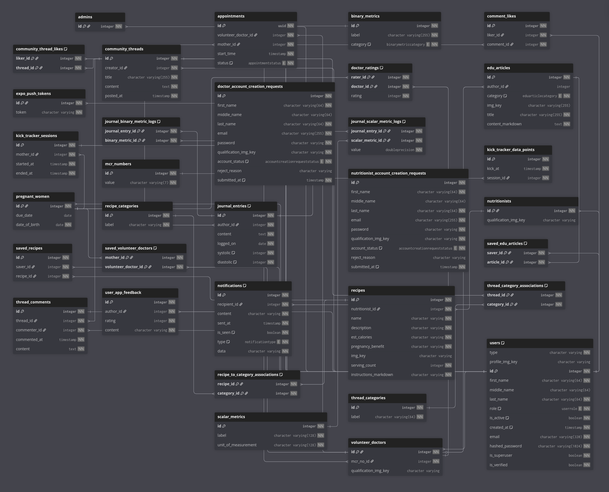

# MyPregnancy

A mobile application designed to support women throughout their pregnancy

---

## Quick start

### Prerequisites

- [Node.js _(via nvm)_](https://nodejs.org/en/download)
  - Install the LTS: `nvm install --lts && nvm use --lts`
- [Docker](https://www.docker.com/)
- [Android Studio](https://developer.android.com/studio)
  - Make sure to follow the [Expo docs](https://docs.expo.dev/get-started/set-up-your-environment/?platform=android&device=physical&mode=development-build&buildEnv=local) develop using _Android Device & Development Build_
- [uv](https://docs.astral.sh/uv/)
  - Windows: ```powershell -ExecutionPolicy ByPass -c "irm https://astral.sh/uv/install.ps1 | iex"```
  - MacOS & Linux: ```curl -LsSf https://astral.sh/uv/install.sh | sh```

---

For these next steps, you will need two terminals - one for the frontend and one for the backend

### Frontend

1. `cd frontend`
2. **[First time]**
    - Install dependencies: `npm i`
    - Create a copy of the `.env.example` and rename it to `.env`

Now, there are multiple ways of running the app, but I highly recommend a local build

#### Locally build development APK
First create a _development build_ of your APK
- You need first globally instal the EAS CLI `npm install -g eas-cli`
- Login to EAS _(requires an account)_: `eas login`
- Build! `eas build --profile development --platform android --local`
  - The `--local` flag is very important here, otherwise it will eat up your free EAS _"cloud builds"_
- Once completed, the path to the generated APK will be generated. Transfer this onto your mobile device and install it

Next, you have 2 options for allowing your mobile device to connect
- **Wireless:** Assuming your mobile device is on the same private network and subnet, you'd have to create 2 firewall rules
  - Allow inbound TCP 192.168.1.0/24 on port 8081 _(Expo Metro Bundler)_
  - Allow inbound TCP 192.168.1.0/24 on port 8000 _(FastAPI backend)_
  - Allow inbound TCP 192.168.1.0/24 on port 4567 _(LocalStack)_


- **Wired:** I have no idea how, but you can research into making use of `adb reverse`


From now on, during development, you just have to
- Call `npx expo start --dev-client`, a QR code should be presented
- Scan the code using the previously installed APK on your mobile device

#### Android Emulator
Similar to the previous method of _building a local dev APK_, but you run via `npx expo start:android`

If you have properly previously configured the Android Studio step at the start, the emulator should open automagically

### Backend

1. `cd backend`
2. **[First Time]**
   - Create a Python virtual environment `uv venv`
   - Activate the virtual environment
      - macOS and Linux: `source venv/bin/activate`
      - Windows: `venv\Scripts\Activate.bat`
   - Install dependencies: `uv sync`
   - Create a copy of the `.env.example` and rename it to `.env`
3. `docker compose up` _(Having issues? Try to force a fresh build with_ `docker compose up --build --remove-orphans` _)_
4. `docker compose down` to stop the running container(s)

---

## Workflow

#### Database Migrations

_(this assume the 'backend' directory as the root)_
Currently, schemas are all defined within `./app/db/db_schema.py`

1. Whenever you modify a schema, generate a new migration
   `alembic revision --autogenerate -m "<YOUR SAVE MESSAGE>"`
2. Immediately apply your newly-generated migrations
   `alembic upgrade head`

#### Managing Python Dependencies

_If you ever need to install or uninstall a new Python package during development, make sure that you first activate your virtual environment_

* Adding packages: `uv add <MY_PACKAGE>`
* Removing packages: `uv remove <MY_PACKAGE>`
* Sync up with lockfile: `uv sync`

#### Testing

Simply run `pytest`
That's it.

### Managing LocalStack
Will can manage your LocalStack resources through the web console [here](https://app.localstack.cloud/inst/default/status) _(will require a free account)_

---

## Database Schema (Updated 12-Dec-25)



## Service Architecture (Updated 16-Nov-25)


